# 🐾 GANADI — 반려동물 안과질환 AI 스크리닝 플랫폼

> 반려동물의 안구 사진 한 장으로 강아지 10종·고양이 5종의 안과질환을 AI가 스크리닝하고,
> AI 소견 리포트(PDF)부터 수의사 연계·주변 동물병원 찾기까지 이어주는 모바일 웹(PWA) 서비스

🏆 **세종대학교 컴퓨터공학과 캡스톤디자인 2026-1 · 최우수상 수상**

🗓️ **프로젝트 기간:** 2026년 3월 3일 ~ 2026년 6월 12일 (16주)
🌐 **서비스 URL:** ganadi.site

---

## 📖 서비스 소개

국내 반려가구는 591만 가구(2024년 기준)에 달하지만, 내원 동물 3마리 중 1마리가
안구질환을 보유함에도 조기 발견·수의사 연계 서비스가 부재합니다.

GANADI 보호자가 **스마트폰으로 촬영한 반려동물 눈 사진 한 장**에서 출발해,
아래 5단계로 이어지는 엔드투엔드 플랫폼을 제공합니다.

```
📷 사진 촬영/업로드  →  🤖 AI 스크리닝  →  📄 AI 소견 리포트(PDF)  →  🩺 수의사 연계  →  🗺️ 주변 병원 찾기
```

| 대상 | 제공 기능 |
|---|---|
| 👤 보호자 | 반려동물 등록, 안구 사진 AI 스크리닝(Top-3), AI 소견 PDF, 수의사 소견 요청, 병원 찾기 |
| 🩺 수의사 | 소견 요청 수신, 전문 소견 작성, 완료 이력 관리 (관리자 승인 후 활동) |
| 🛠️ 관리자 | 수의사 승인, 사용자·신고 관리, 스크리닝 통계 조회 |

> ⚠️ 본 서비스는 의료 진단을 대체하지 않으며, AI 결과는 참고용 스크리닝 소견입니다.

---

## 📸 서비스 화면

### 👤 보호자 (모바일)

<table>
  <tr>
    <td align="center"><b>로그인</b><br>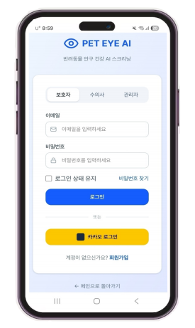</td>
    <td align="center"><b>반려동물 관리</b><br>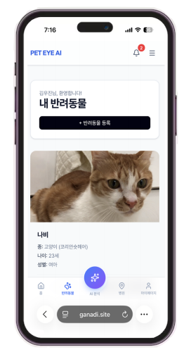</td>
    <td align="center"><b>안구 크롭</b><br>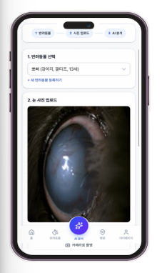</td>
  </tr>
  <tr>
    <td align="center"><b>AI 스크리닝 결과</b><br>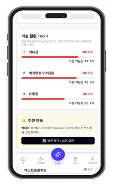</td>
    <td align="center"><b>AI 소견 보고서</b><br>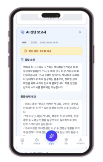</td>
    <td align="center"><b>AI 소견 리포트(PDF)</b><br>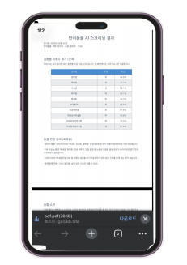</td>
  </tr>
  <tr>
    <td align="center"><b>병원 찾기</b><br>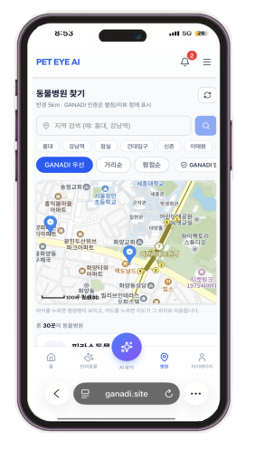</td>
    <td align="center"><b>수의사 소견서</b><br>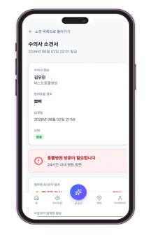</td>
    <td align="center"><b>수의사 소견서 리포트(PDF)</b><br>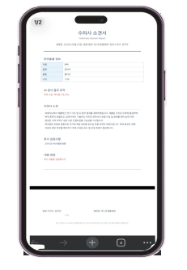</td>
  </tr>
</table>

### 🩺 수의사 포털 (PC)

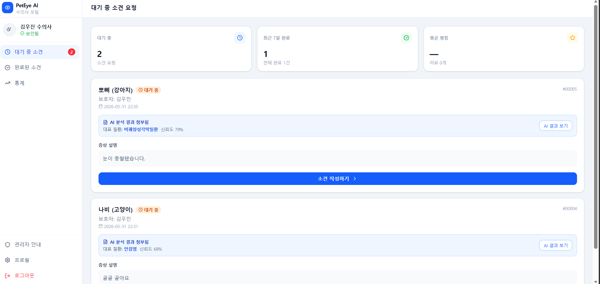

### 🛠️ 관리자 대시보드 (PC)

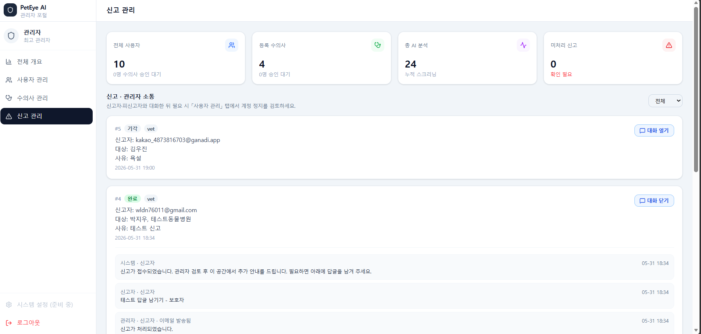

---

## ✨ 주요 기능

### 🤖 AI 스크리닝
- 안구 사진 → 강아지 10종 / 고양이 5종 질환 Top-3 스크리닝
- EfficientNet-B3 멀티태스크 모델
- Grad-CAM 병변 위치 시각화, ONNX 경량화 변환
- Claude API 기반 AI 소견 리포트 자동 생성 + PDF 제공

### 📱 서비스 기능
- 카메라 촬영 → 안구 크롭 → 실시간 AI 분석
- Kakao Map 기반 주변 동물병원 + GANADI 인증 병원 필터
- 보호자 / 수의사 / 관리자 3종 포털
- Kakao OAuth 로그인, SMTP 비밀번호 재설정, Web Push 알림, 진단 이력 관리

---

## 🏗 시스템 아키텍처

GANADI **3-tier + AI inference service** 구조로, AWS EC2 위에서 Docker Compose와 Nginx로 통합 운영됩니다.

<!-- 최종보고서의 시스템 구성도 이미지를 넣으세요 -->
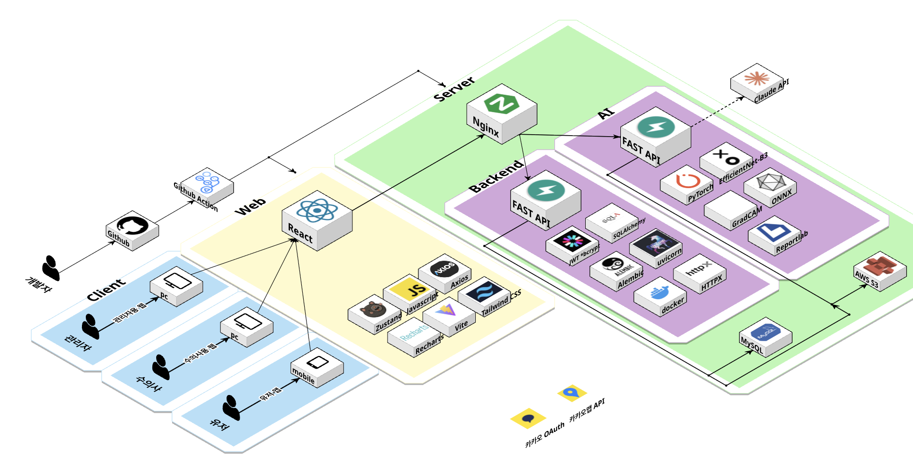

| 계층 | 기술 |
|---|---|
| Frontend | React · TypeScript · Vite · PWA · TailwindCSS |
| Backend | FastAPI · SQLAlchemy · Alembic · JWT · SMTP · Web Push |
| AI Server | PyTorch · EfficientNet-B3 · Grad-CAM · ONNX |
| Data / Infra | MySQL(RDS) · AWS S3 · Docker Compose · Nginx · AWS EC2 |
| 외부 연동 | Claude API · Kakao OAuth · Kakao Map · SMTP |
| 협업 / CI | Git 모노레포 · GitHub Actions · pytest · 브랜치 보호 규칙 |

---

## 🗄 핵심 데이터 모델

백엔드 핵심 엔티티는 `User`, `Pet`, `DiagnosisResult`, `Opinion`, `Notification`입니다.

<!-- 최종보고서의 클래스 다이어그램 / 데이터맵 이미지를 넣으세요 -->
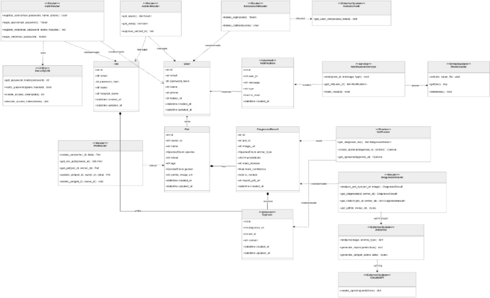

| 관계 | 다중성 | 설명 |
|---|---|---|
| User → Pet | 1 : N | 한 보호자가 여러 반려동물 등록 |
| User → Notification | 1 : N | 한 보호자가 여러 알림 수신 |
| Pet → DiagnosisResult | 1 : N | 한 반려동물이 여러 번 진단 |
| DiagnosisResult → Opinion | 1 : 1 | 진단 1건당 수의사 소견 1건 |
| Vet → Opinion | 1 : N | 한 수의사가 여러 소견 작성 (승인 상태 `is_approved` 포함) |

---

## 💡 트러블슈팅

| 문제 | 원인 | 해결 |
|---|---|---|
| **AI 모델 Device 의존성** | 학습 데이터에 전문 장비(안저카메라·안구초음파) 촬영 이미지가 다수 포함되어, 모델이 질환 특징보다 촬영 장비 패턴에 의존 | 전문 장비 데이터를 필터링하고 Device를 학습 변수로 명시적으로 추가 |
| **Kakao OAuth 로그인 실패** | 리다이렉트 URI를 모바일 테스트용 앱 키에 등록했으나 실제 로그인은 대표 앱 키로 처리되어 불일치 | 리다이렉트 URI 설정을 대표 앱 키로 일원화 |
| **AI 서버·백엔드 메모리 부족** | 동일 EC2 인스턴스에 모든 서비스 배포 시 EfficientNet-B3 모델 로딩으로 메모리 부족 | AI 서버를 별도 EC2 인스턴스로 분리 배포 |

---

## 👥 팀 구성

<table>
  <tr>
    <td align="center" width="25%">
      <a href="https://github.com/leejunyoung0610">
        <br>
        <b>이준영</b>
      </a><br>
      <sub>AI</sub>
    </td>
    <td align="center" width="25%">
      <a href="https://github.com/wldn7601">
        <br>
        <b>박지우</b>
      </a><br>
      <sub>Backend</sub>
    </td>
    <td align="center" width="25%">
      <a href="https://github.com/woojin-archive">
        <br>
        <b>김우진</b>
      </a><br>
      <sub>Backend</sub>
    </td>
    <td align="center" width="25%">
      <a href="https://github.com/kurr23">
        <br>
        <b>박민지</b>
      </a><br>
      <sub>Frontend</sub>
    </td>
  </tr>
</table>

---

## 📁 프로젝트 구조

```
.
├── GANADI-backend/    # FastAPI 백엔드 (API · 인증 · DB)
├── GANADI-frontend/   # React PWA 프론트엔드
└── GANADI-AI/         # AI 서버 (EfficientNet-B3 · ONNX · Claude API)
```

---

## 🛠 실행 방법

```bash
# 저장소 클론
git clone <repo-url>
cd Capstone_GANADI

# 백엔드 (FastAPI)
cd GANADI-backend
python -m venv venv && source venv/bin/activate
pip install -r requirements.txt
cp .env.example .env
alembic upgrade head
python -m app.main

# 프론트엔드
cd ../GANADI-frontend && npm install && npm run dev
```

프로덕션은 Docker Compose로 배포합니다.

```bash
docker compose -f docker-compose.prod.yml up -d
```

---

## ⚠️ 면책

본 서비스는 의료 진단을 대체하지 않습니다. AI 결과는 참고용 스크리닝 소견이며,
정확한 진단·치료는 반드시 수의사와 상담해야 합니다.

---

## 📄 라이선스

세종대학교 컴퓨터공학과 캡스톤디자인 프로젝트 (2026)
